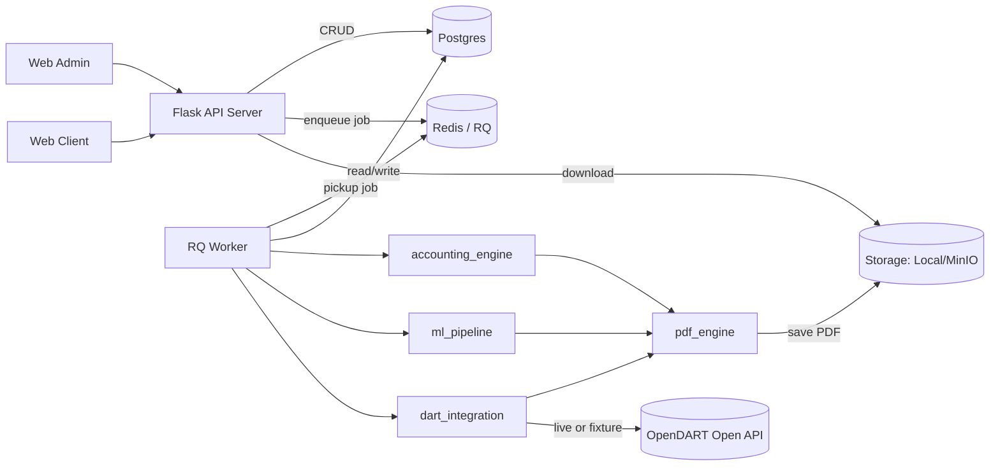
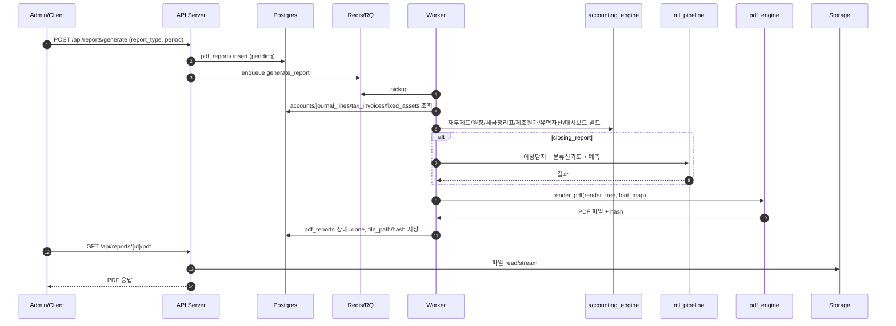
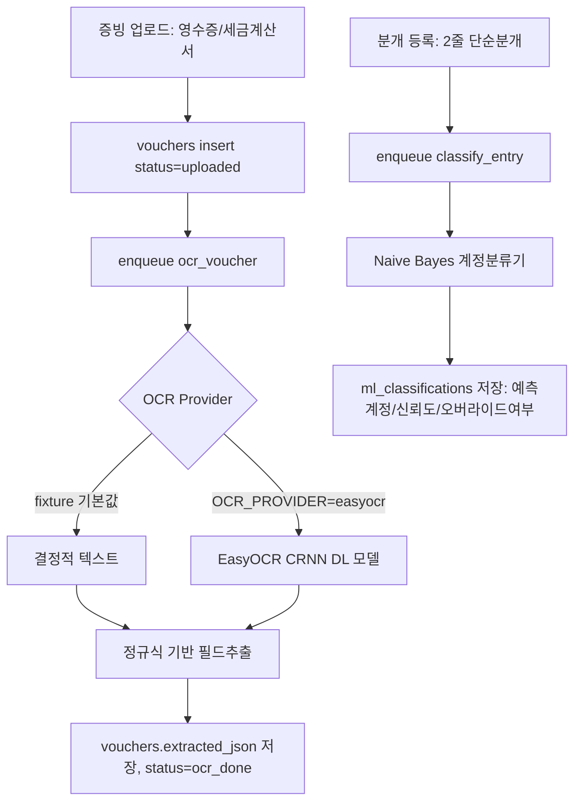
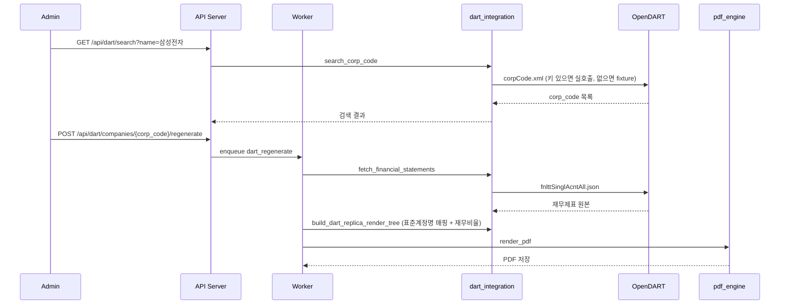

# 시스템 아키텍처/워크플로우 (v2.0)

## 1) 구성
- Web Admin / Web Client: Vanilla JS 정적 페이지 (fetch 기반 REST 호출)
- API Server: Flask REST API (인증 없음, MVP) — 회사/분개/증빙/보고서/ML/DART 엔드포인트
- Worker: RQ(Redis Queue) 비동기 작업자 — OCR, 계정분류, PDF 생성, DART 재현
- DB(Postgres), Queue(Redis), Storage(Local/MinIO)
- 외부 연동: OpenDART Open API

---

## 2) 전체 구성도

---

## 3) 기장 보고서 생성 플로우

---

## 4) 증빙 OCR → 분개 보조 플로우

---

## 5) OpenDART 재현 플로우

---

## 6) 핵심 설계 포인트
- **웹/워커 분리**: 동기 API 요청과 무거운 PDF/OCR/외부API 작업을 비동기로 분리.
- **패키지 분리**: accounting_engine(회계 로직) / ml_pipeline(ML/DL) / pdf_engine(렌더링) / dart_integration(외부연동)을 독립 모듈화해 단위테스트 용이.
- **렌더트리 공통 포맷**: 모든 보고서 빌더가 `{"pages":[{"page":..,"nodes":[text|table|bar_chart]}]}` 동일 포맷을 반환 → pdf_engine 하나로 전 문서 렌더링.
- **ML 결과 추적성**: 모든 분류/이상탐지/예측 결과에 `model_version`을 기록해 회귀 비교/감사 가능.
- **오프라인 대체 경로**: EasyOCR/OpenDART 모두 "실제 연동"과 "fixture 대체"를 동일 인터페이스로 제공해 네트워크/키 없이도 개발·테스트 가능.
