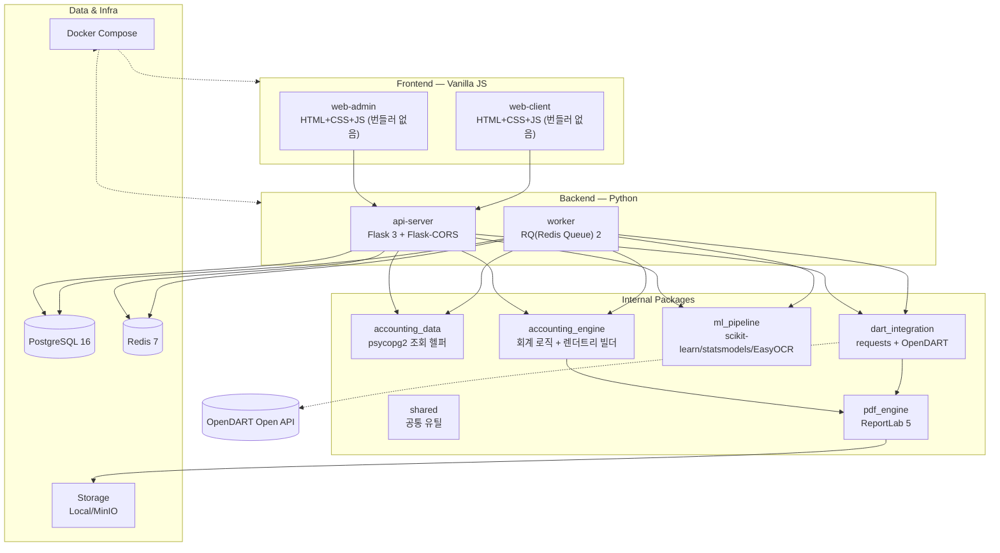
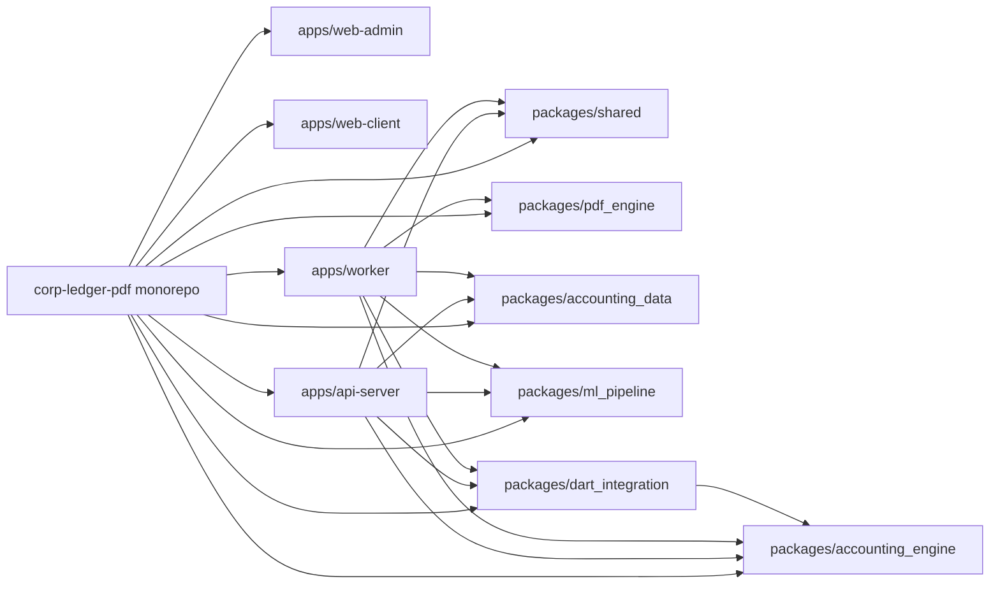
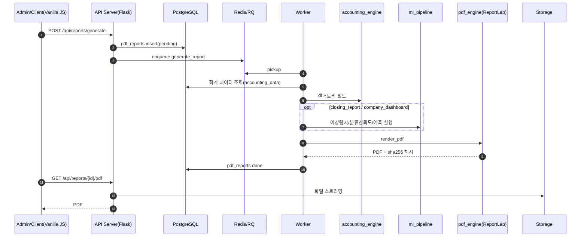

# 기술 스택 & ML/DL 알고리즘 상세 (v2.0)

본 문서는 이 레포의 **실제 구현 기준 기술 스택**, **E2E 워크플로우**, 그리고 요청하신
**도입 ML/DL 알고리즘의 상세(문제정의/선택이유/입출력/한계/프로덕션 고도화 경로)**를 정리합니다.

---

## 1) 기술 스택 한눈에 보기

## 2) 패키지 의존 관계

## 3) 기술 선택 요약표

| 영역 | 선택 | 이유 |
|---|---|---|
| 백엔드 웹 | Flask 3 | 기존 Express 수준의 미니멀함 유지, 러닝커브 최소화 |
| 작업 큐 | RQ(Redis Queue) | Celery 대비 설정이 단순하고 BullMQ와 개념적으로 가장 유사(단일 Redis, 데코레이터 없이 함수 참조로 enqueue) |
| PDF 생성 | ReportLab 5 | canvas 기반 절대좌표 드로잉으로 bleed/폰트 임베딩을 코드로 직접 제어(pdf-lib과 동일 철학) |
| DB 드라이버 | psycopg2-binary | ORM 없이 원시 SQL 유지(기존 pg 드라이버 사용 패턴과 동일), 배포 간소화 |
| 계정분류 | scikit-learn (TF-IDF+MultinomialNB) | 적은 라벨 데이터로도 안정적인 baseline, 학습/추론이 수 ms |
| 이상탐지 | scikit-learn IsolationForest | 라벨 없는 비지도 학습, 비정규 분포에 강건 |
| 시계열 예측 | statsmodels ExponentialSmoothing | 짧은 이력(수개월)에서도 추세 반영 가능한 검증된 baseline |
| OCR | EasyOCR(선택) / Fixture(기본) | 실제 사전학습 DL 모델을 옵션으로 제공하되, 기본 실행은 가볍고 결정적으로 유지 |
| 외부 공시 연동 | requests + OpenDART Open API | 공식 공개 API, 표준 JSON/XML 스키마 |
| 프론트엔드 | Vanilla JS | 번들러/프레임워크 없이 fetch만으로 REST 연동 — 배포/유지보수 단순화 |

---

## 4) 전체 워크플로우 (보고서 생성)

---

## 5) 도입 ML/DL 알고리즘 상세

### 5-1. 증빙 OCR + 정보추출 (`packages/ml_pipeline/ml_pipeline/ocr/`)

**문제 정의**: 영수증/세금계산서 이미지에서 텍스트를 인식하고, 사업자등록번호·금액·일자·거래처 등 정형 필드를 추출한다.

**알고리즘**
1. **OCR(텍스트 인식)** — `EasyOcrProvider`: **EasyOCR**을 사용하며, 내부적으로 CNN(ResNet 계열) 특징추출 + **BiLSTM** 시퀀스 인코딩 + **CTC(Connectionist Temporal Classification)** 디코딩으로 구성된 실제 사전학습 딥러닝 모델(CRNN)입니다. 한국어/영어 가중치를 최초 실행 시 다운로드/캐시합니다.
2. **필드 추출** — `extractor.py`: OCR 텍스트에 정규식(사업자등록번호 `\d{3}-\d{2}-\d{5}`, 금액/일자 패턴)을 적용하는 규칙 기반 후처리.

**선택 이유**: 실제 라벨링된 한국 영수증/세금계산서 이미지 데이터셋이 없는 상태에서 LayoutLM/Donut 같은 문서이해 모델을 처음부터 학습시키는 것은 비현실적입니다. EasyOCR은 이미 대규모 데이터로 사전학습된 텍스트 인식 모델을 제공하므로 "이미지→텍스트"는 실제 DL 모델을 그대로 활용하고, "텍스트→구조화"는 검증 가능한 규칙 기반으로 처리해 정확도와 설명가능성을 모두 확보했습니다.

**입출력**
- 입력: 이미지 파일 경로
- 출력: `{"text": str, "confidence": float, "engine": str}` → `extract_fields()` → `{"biz_reg_no", "issue_date", "supply_amount", "tax_amount", "total_amount", "counterparty_name"}`

**기본 실행 경로**: `OCR_PROVIDER=fixture`(기본값) — 네트워크/GPU 없이 결정적 텍스트로 동작(자동화 테스트/기본 데모용). `OCR_PROVIDER=easyocr`로 전환하면 실제 DL 모델이 로드됩니다(`requirements-ocr.txt` 별도 설치 필요, torch 포함으로 용량이 큼).

**한계**
- 규칙 기반 추출기는 문서 레이아웃이 크게 다르면(표 형태 세금계산서 등) 필드 매칭이 실패할 수 있음.
- EasyOCR은 저해상도/기울어진 이미지에서 인식률이 떨어질 수 있음(전처리 미포함).

**프로덕션 고도화 경로**: 라벨링된 문서 이미지가 수백~수천 건 이상 축적되면 **LayoutLM/Donut** 같은 레이아웃 인지 Document AI 모델로 교체해 표 구조를 직접 이해시키거나, 클라우드 Document AI(예: 상용 OCR API)로 대체 가능.

---

### 5-2. 계정과목 자동분류 (`packages/ml_pipeline/ml_pipeline/classifier/account_classifier.py`)

**문제 정의**: 거래 적요(자유 텍스트, 예: "카카오T 택시 이용료")를 보고 알맞은 계정과목 코드(예: "822 차량유지비")를 예측한다.

**알고리즘**: `TfidfVectorizer(analyzer="char_wb", ngram_range=(2,3))` + `MultinomialNB()` (scikit-learn `Pipeline`).

**선택 이유**: 한국어는 형태소 분석기 없이 공백 기준으로 토큰화하면 부정확합니다(예: "택시비" vs "택시 비"). **문자 n-gram(char n-gram)** 벡터화는 형태소 분석기 없이도 부분 문자열 유사도를 포착해 안정적으로 동작합니다. Naive Bayes는 수십~수백 건의 적은 라벨 데이터에서도 과적합 없이 합리적인 baseline을 제공하며, 학습/추론이 매우 빨라(수 ms) 동기 API(`/api/ml/classify-preview`)에서도 즉시 응답이 가능합니다.

**입출력**
- 학습 데이터: `packages/ml_pipeline/ml_pipeline/data/labeled_transactions.json` (78건, 17개 계정과목 커버)
- 입력: 거래 적요 텍스트
- 출력: `{"account_code": str, "confidence": float, "distribution": {code: prob}, "model_version": "account-classifier-nb-v1"}`

**모델 아티팩트**: `packages/ml_pipeline/ml_pipeline/models/account_classifier.joblib` (커밋된 경량 아티팩트, `scripts/train_classifier.py`로 재학습 가능). 아티팩트가 없으면 `AccountClassifier.load_default()`가 라벨 데이터로 즉석 학습합니다.

**통합 지점**: 2줄 단순분개가 등록되면 `classify_entry` job이 비동기로 실행되어 예측 결과를 `ml_classifications`에 기록하고, 실제 입력 계정과 다르면 `is_override=true`로 표시해 추후 재학습 데이터로 활용할 수 있습니다.

**한계**: 라벨 데이터가 적어 학습 데이터에 없는 완전히 새로운 유형의 거래(예: 특수 업종 용어)는 신뢰도가 낮게 나올 수 있습니다(`/api/ml/classify-preview`로 사전 확인 권장).

**프로덕션 고도화 경로**: 실거래 라벨이 수만 건 이상 누적되면 KoBERT/RoBERTa 파인튜닝 또는 문장 임베딩 기반 분류로 전환해 정확도를 높일 수 있습니다.

---

### 5-3. 이상거래/오분류 탐지 (`packages/ml_pipeline/ml_pipeline/anomaly/anomaly_detector.py`)

**문제 정의**: 특정 계정에서 평소와 크게 다른 금액의 거래(입력 실수, 오분류, 부정거래 가능성)를 탐지한다.

**알고리즘**: scikit-learn `IsolationForest` (비지도 학습, 랜덤 파티셔닝 트리 앙상블). 계정과목별로 별도 모델을 학습(계정마다 정상 금액 스케일이 크게 다르기 때문).

**선택 이유**: 이상거래는 "정상/이상" 라벨이 없는 경우가 대부분입니다. IsolationForest는 라벨 없이도 동작하며, 회계 데이터처럼 오른쪽으로 치우친(skewed) 금액 분포에서 단순 z-score보다 안정적으로 이상치를 분리합니다.

**입출력**
- 입력: `journal_lines`(entry_id, account_code, debit, credit, entry_date)
- 출력: 이상 거래 목록 `[{"entry_id", "account_code", "amount", "score", "reason", "model_version": "isolation-forest-v1"}]`
- 계정별 표본 수가 `min_samples`(기본 4) 미만이면 신뢰할 수 없다고 보고 스킵합니다.

**통합 지점**: `GET /api/ml/anomalies`(동기 조회 + `ml_anomalies` 기록), `closing_report` 생성 시 자동 포함.

**한계**: 여러 종류의 거래가 섞이는 공용 계정(예: 현금/예금 102)은 오탐이 발생하기 쉽습니다(실제 검증에서도 확인됨 — 계정 성격이 이질적일수록 단변량 이상탐지의 한계가 드러남).

**프로덕션 고도화 경로**: 금액 외에 요일/거래처/적요 임베딩 등 다변량 특징을 추가하거나, Autoencoder 기반 재구성오차 이상탐지로 확장할 수 있습니다.

---

### 5-4. 현금흐름/매출 예측 (`packages/ml_pipeline/ml_pipeline/forecast/cashflow_forecast.py`)

**문제 정의**: 월별 매출/현금흐름 이력을 바탕으로 향후 N개월을 예측한다.

**알고리즘**: statsmodels `ExponentialSmoothing`(Holt 선형 지수평활, `trend="add"`, `seasonal=None`). 이력이 4개월 미만이면 과적합을 피하기 위해 최근값을 반복하는 **naive baseline**으로 자동 대체(`model_version="naive-last-value-v1"`).

**선택 이유**: 법인 회계 데이터는 보통 이력이 수개월~수년 규모로, LSTM/Prophet 같은 대용량 시계열 모델을 학습하기엔 데이터가 부족한 경우가 많습니다. Holt 지수평활은 적은 데이터로도 추세(trend)를 반영한 예측을 안정적으로 제공하는 산업 표준 baseline입니다.

**입출력**
- 입력: `monthly_series()`로 집계한 (YYYY-MM, 금액) 시계열
- 출력: `{"forecast": [float, ...], "model_version": str}`

**통합 지점**: `GET /api/ml/forecast?metric=revenue|cash_flow`(동기 조회 + `ml_forecasts` 기록), `closing_report`의 다음 달 예측치.

**검증 사례**: 시드 데이터(월 +400,000원 우상향 추세, 6개월치)에 대해 Holt 모델이 추세를 정확히 이어받아 예측(예: 5,000,000 → 5,400,000 → 5,800,000 → 6,200,000)함을 실제 실행으로 확인.

**프로덕션 고도화 경로**: 24개월 이상의 데이터가 누적되면 Prophet(계절성 반영) 또는 LSTM/Temporal Fusion Transformer 기반 다변량 예측으로 전환 가능.

---

### 5-5. OpenDART 연동 (`packages/dart_integration/`) — ML은 아니지만 데이터 파이프라인의 핵심

**문제 정의**: 회사명으로 실제 공시 기업을 검색하고, 해당 재무제표를 수집해 본 모듈의 PDF 템플릿으로 "재현"한다.

**구현**
- `client.py`: `corpCode.xml`(zip, 전체 기업 코드) 다운로드/캐시/파싱 후 이름으로 검색, `fnlttSinglAcntAll.json`(전체 재무제표) 조회.
- `mapper.py`: DART 표준계정명(기업마다 "매출액"/"영업수익" 등 표기가 다름)을 후보 목록으로 매칭해 내부 요약 지표(`asset_total`, `revenue_total`, `net_income` 등)로 변환 후, `accounting_engine.ratios.compute_ratios`를 그대로 재사용해 재무비율 계산.
- **키 부재 시 자동 대체**: `DART_API_KEY`가 없으면 `fixtures/`의 실제 공개 데이터(삼성전자 2023 재무제표 축약본, 공식 API 응답 그대로)를 사용해 동일 인터페이스로 동작.

**실검증**: 개발 중 실제 발급된 OpenDART 키로 `corpCode.xml`(3.5MB zip) 다운로드, 삼성전자 2023년 재무제표(`fnlttSinglAcntAll.json`) 조회, 내부 템플릿으로 PDF 재현까지 **라이브 E2E로 검증 완료**(자산총계 455,905,980,000,000원 등 실제 공시 수치 일치).

---

## 6) 회계 로직 (ML은 아니지만 문서 생성의 핵심 — `packages/accounting_engine/`)
- `statements.py`: 계정유형별(자산/부채/자본/수익/비용) 잔액 집계 → 재무상태표/손익계산서
- `ledger.py`: 계정별 원장(총계정원장) + 시간순 분개장, 26행/페이지 자동 페이지네이션
- `tax_summary.py`: 매입/매출 세금계산서 합계 + 납부(환급)세액
- `manufacturing_cost.py`: `accounts.cost_category`(재료비/노무비/제조경비) 태깅 기반 제조원가명세서, 기초/기말 재공품 반영한 당기제품제조원가 계산
- `fixed_assets.py`: 정액법(straight-line) 감가상각 계산 + 유형자산 목록/장부가액
- `ratios.py`: 부채비율/자기자본비율/순이익률/**수출비중**(매출 세금계산서의 market=export 비중)
- `company_dashboard.py` / `closing_report.py`: 위 결과들을 ML 분석 요약과 결합해 하나의 다페이지 PDF로 구성

## 7) 검증 이력 (실제 실행 기준)
- 전 패키지 pytest 52건 통과(단위 테스트 + DART 라이브 API 호출 포함)
- Postgres/Redis 로컬 컨테이너 기동 → 마이그레이션/시드 → Flask API + RQ 워커 실제 기동
- 5종 보고서(재무제표/원장/세금정리표/결산보고서/기업대시보드) + DART 재현 PDF **실제 생성 및 PDF 페이지 렌더링 확인**(한글 폰트 임베딩 포함)
- 증빙 OCR → 필드추출 → 계정분류 → 이상탐지 → 예측까지 전체 파이프라인 실제 데이터로 E2E 확인
- Docker 이미지 4종(api/worker/web-admin/web-client) 전체 빌드 성공 확인
